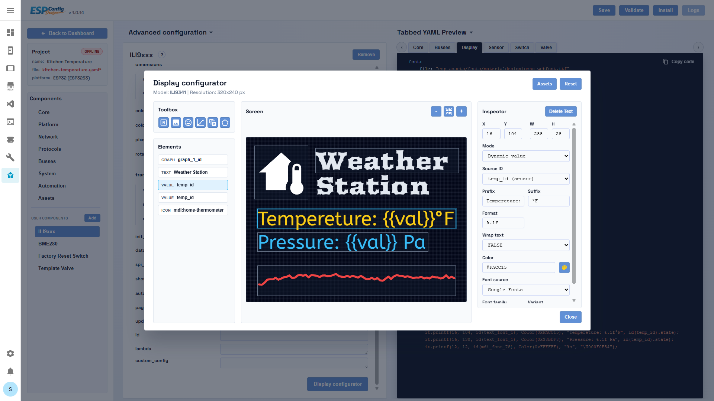

# ESPConfig Designer v.1.2.2

ESPConfig Designer — это Ingress-аддон для Home Assistant, предназначенный для создания, структурирования, валидации, компиляции и развертывания конфигураций ESPHome с помощью визуального редактора на основе схем.

Репозиторий содержит полный код аддона:

- `esp-config-designer/` -> бэкенд аддона Home Assistant и API
- `esp-config-designer-frontend/` -> фронтенд на Vue 3 (Панель управления / Dashboard + Конструктор / Builder)

Аддон разработан для того, чтобы пользователи могли полностью управлять проектами ESPHome без ручного редактирования файлов YAML, если они этого не хотят.

---

## Взаимосвязь с ESPHome

ESPConfig Designer — это независимый инструмент визуальной конфигурации для ESPHome. Он не связан с проектами ESPHome или Home Assistant, не поддерживается, не спонсируется и не одобрен ими.

Назначение ESPConfig Designer — упростить создание и обслуживание конфигураций ESPHome с помощью графического редактора, управляемого схемами. Результатом его работы является стандартный YAML-файл ESPHome, который можно валидировать, компилировать и устанавливать с использованием стандартного инструментария ESPHome.

Сам проект ESPHome является отдельным проектом с открытым исходным кодом, распространяемым под собственными лицензиями. Пожалуйста, обращайтесь к официальному репозиторию и документации ESPHome для получения сведений о лицензировании, документации, поведении компонентов и совместимости.

Название «ESPHome» используется в этом проекте исключительно для описания совместимости с экосистемой ESPHome.

---

## Возможности

ESPConfig Designer предоставляет:

- Панель управления (Dashboard) для просмотра проектов в виртуальных папках
- Конструктор (Builder) для редактирования конфигурации устройств через JSON-схемы
- Интерактивный предпросмотр YAML, генерируемый в реальном времени на основе состояния форм
- Конфигуратор дисплея (Display Configurator) для компонентов, связанных с экранами
- Менеджер ресурсов (Asset Manager) для изображений, шрифтов и аудио
- Интегрированные процессы валидации / очистки / компиляции / OTA-обновления / просмотра логов
- Сохранение проектов, редактирование секретов (secrets.yaml) и отслеживание статуса устройств

Бэкенд отвечает за хранение данных, файлы, выполнение задач и артефакты прошивки.
Фронтенд отвечает за интерфейс редактирования, обработку схем во время выполнения, генерацию предпросмотра и организацию процессов установки/логирования.

---

### Панель управления (Dashboard)
Временное изображение должно показывать:

- дерево папок слева
- карточки/сетку проектов
- индикаторы статуса устройств (онлайн/офлайн)
- верхнюю панель действий


### Конструктор (Builder)
Временное изображение должно показывать:

- вкладки Конструктора
- редактирование формы на основе JSON-схем
- предпросмотр YAML на панели справа
- верхнюю панель действий (`Save`, `Validate`, `Install`, `Logs`)


### Конфигуратор дисплея (Display Configurator)
Временное изображение должно показывать:

- область предпросмотра (холст)
- панель инспектирования и редактирования элементов
- примеры текстовых элементов, иконок, изображений и фигур



### Менеджер ресурсов (Asset Manager)
Временное изображение должно показывать:

- модальное окно с вкладками Шрифты (Fonts), Изображения (Images), Аудио (Audio)
- элементы управления загрузкой, переименованием и удалением


---

## Структура репозитория

### Корневая директория
- `README.md` -> публичное описание репозитория

### Бэкенд (`esp-config-designer/`)
- Приложение на Flask, обслуживающее API и предоставляющее собранный фронтенд
- Сохраняет файлы проектов JSON, файлы конфигурации YAML, ресурсы, информацию об устройствах, задачи и артефакты прошивок
- Запускает CLI-команды ESPHome и транслирует логи через потоковые эндпоинты

Важные файлы:

- `esp-config-designer/server.py`
- `esp-config-designer/config.json`
- `esp-config-designer/run.sh`
- `esp-config-designer/Dockerfile`
- `esp-config-designer/web/`

### Фронтенд (`esp-config-designer-frontend/`)
- Приложение на Vue 3 + Vite, встроенное внутрь аддона
- Содержит:
  - Панель управления (Dashboard)
  - Конструктор (Builder)
  - Конфигуратор дисплея (Display Configurator)
  - Менеджер ресурсов (Asset Manager)
  - Общую консоль для установки и логов

Важные файлы:

- `esp-config-designer-frontend/src/App.vue`
- `esp-config-designer-frontend/src/views/DashboardView.vue`
- `esp-config-designer-frontend/src/views/BuilderView.vue`
- `esp-config-designer-frontend/public/components_list/components_list.json`
- `esp-config-designer-frontend/public/schemas/`

---

## Обзор архитектуры

### Зоны ответственности бэкенда
- Сохранение файлов YAML
- Сохранение файлов проектов JSON
- Сохранение индекса виртуальных папок
- Доступ к файлу секретов (secrets.yaml)
- Предоставление каталога компонентов, импорт и удаление пользовательских компонентов
- API ресурсов (изображения, шрифты, аудио)
- Реестр устройств и их статус подключения
- Запуск задач ESPHome по валидации, компиляции, установке и выводу логов
- Поиск и отдача собранных артефактов прошивки
- Статический хостинг собранного фронтенда

### Зоны ответственности фронтенда
- Проводник панели управления и интерфейс выбора проектов
- Отрисовка форм на основе JSON-схем
- Загрузка схем и разрешение механизма наследования (`extends`)
- Генерация YAML для предпросмотра/экспорта
- Интерфейс редактора дисплея
- Валидация на стороне клиента и предупреждения о взаимозависимых полях
- Управление модальным окном установки прошивки и вывода логов

### Взаимодействие фронтенда и бэкенда (контракт)
- Фронтенд отправляет запросы к бэкенду по HTTP (совместимому с Ingress) с параметром `credentials: include`
- Фронтенд сохраняет состояние проекта исключительно через API-эндпоинты бэкенда
- В JSON проекта хранится конфигурация времени выполнения, а не файлы схем
- Метаданные каталога компонентов являются единственным источником истины для пути к схеме компонента (`schemaPath`)

---

## Основные пользовательские сценарии (User Flows)

### Панель управления (Dashboard)
- Просмотр проектов в виртуальных папках
- Открытие существующего проекта в Конструкторе
- Создание пустого проекта (`New device`)
- Вызов валидации, установки и логов для выбранного проекта
- Настройка внешнего вида карточки проекта

### Конструктор (Builder)
- Редактирование конфигурации проекта на основе схем
- Интерактивный предпросмотр генерируемого YAML
- Управление ресурсами
- Редактирование макетов дисплея
- Сохранение проекта и файла YAML
- Запуск валидации / компиляции / OTA-обновления / прошивки по кабелю / просмотра логов

### Работа с дисплеем
- Создание элементов текста, иконок, изображений, фигур, графиков и анимаций
- Преобразование шрифтов, картинок и анимаций в ресурсы генерируемого YAML
- Автоматическая генерация кода лямбда-функции дисплея на основе состояния макета

---

## Система схем

Фронтенд полностью управляется схемами (schema-driven).

### Основное расположение схем
- Общие схемы: `esp-config-designer-frontend/public/schemas/general/`
- Схемы компонентов: `esp-config-designer-frontend/public/schemas/components/<domain>/<platform>.json`
- Каталог компонентов: `esp-config-designer-frontend/public/components_list/components_list.json`
- Индекс выбора действий (actions): `esp-config-designer-frontend/public/action_list/base_actions.json`
- Индекс выбора условий (conditions): `esp-config-designer-frontend/public/condition_list/base_conditions.json`

### Ключевые правила
- Схемы поддерживают наследование (`extends`)
- Управление видимостью полей осуществляется через `dependsOn` / `globalDependsOn`
- Вывод YAML настраивается с помощью `emitYAML`
- Зависимости используют имена пространств имен (namespaces), например:
  - `bus:i2c`
  - `protocol:mqtt`
  - `system:psram`
  - `network:wifi`
  - `component:microphone`
- Корневые компоненты-одиночки (singleton) могут рендериться как `root_map`
- `embedded` поддерживает вывод списков и одиночных структур (map)

Подробное руководство по созданию схем находится в файле:

- `docs/HOW_TO_CREATE_SCHEMA.md`

## Модель хранения данных в рантайме

Базовый путь зависит от опции аддона `use_esphome_shared_path`:

- `false` -> `/config/ecd`
- `true` -> `/config/esphome`

Структура хранения данных:

- YAML-файлы: `<base>/*.yaml`
- JSON-файлы проектов: `<base>/esp_projects/*.json`
- Индекс папок: `<base>/esp_projects/projects.json`
- Ресурсы (assets):
  - `<base>/esp_assets/fonts/*`
  - `<base>/esp_assets/images/*`
  - `<base>/esp_assets/audio/*`
  - JSON-файлы манифестов/индексов для каждой группы ресурсов

Состояние выполнения аддона (runtime state):

- Задачи (jobs): `/data/jobs/*.json` and `/data/jobs/*.log`
- Устройства: `/data/devices.json`
- Данные выполнения ESPHome: `/data/esphome`

---

## Сводка API бэкенда

### Проекты и YAML
- `GET /projects/list`
- `GET /projects/load?name=<project>.json`
- `POST /projects/save`
- `POST /save`
- `GET /yaml/load?name=<node>.yaml`
- `DELETE /yaml/delete?name=<node>.yaml`
- `GET /api/secrets/raw`
- `POST /api/secrets/raw`

### Ресурсы (Assets)
- `GET /api/assets/manifest?kind=all|images|fonts|audio&refresh=0|1`
- `GET /api/assets/<kind>/<filename>`
- `POST /api/assets/upload?kind=images|fonts|audio`
- `POST /api/assets/rename`
- `DELETE /api/assets/<kind>/<filename>`
- `GET /api/assets/mdi-substitutions`
- `POST /api/assets/refresh?kind=all|fonts|images|audio`

### Устройства
- `POST /api/devices/register`
- `DELETE /api/devices/unregister?yaml=<node>.yaml|name=<device_key>`
- `GET /api/devices/list?refresh=0|1`
- `GET /api/devices/status?yaml=<node>.yaml&refresh=0|1`

### Задачи и прошивка
- `POST /api/install` (`validate`, `clean`, `compile`, `ota`, `logs`)
- `GET /api/jobs/<job_id>`
- `GET /api/jobs/<job_id>/stream`
- `GET /api/jobs/<job_id>/tail-wait`
- `POST /api/jobs/<job_id>/cancel`
- `GET /api/firmware?yaml=<node>.yaml&variant=factory|ota`

---

## Локальная разработка

### Фронтенд
Запуск из директории `esp-config-designer-frontend/`:

```bash
npm install
npm run dev
npm run build
```

Опциональный автономный режим схем (offline):

Создайте файл `esp-config-designer-frontend/.env.local`:

```bash
VITE_DEV_OFFLINE=1
```

В этом режиме фронтенд считывает каталог и схемы из папки `public/` и игнорирует эндпоинты бэкенда.

### Бэкенд
Бэкенд упакован в виде аддона для Home Assistant. При обычной разработке вы редактируете файлы:

- `esp-config-designer/server.py`
- `esp-config-designer/config.json`
- `esp-config-designer/run.sh`

После внесения изменений в бэкенд необходимо пересобрать/перезапустить аддон.

### Развертывание фронтенда в аддон
1. Соберите фронтенд в директории `esp-config-designer-frontend/`
2. Скопируйте содержимое папки `dist/*` в `esp-config-designer/web/`
3. Пересоберите/перезапустите аддон

---

## Лицензия

ESPConfig Designer распространяется под лицензией MIT.

Если прямо не указано иное, лицензия MIT распространяется на все файлы в данном публичном репозитории, включая бэкенд, фронтенд, включенные бесплатные схемы, формат схем и документацию по созданию схем.

Отдельно распространяемые платные наборы схем (если таковые предлагаются) не являются частью этого репозитория и не подпадают под действие лицензии MIT репозитория, если это явно не указано в самом пакете. Такие наборы могут распространяться на условиях отдельных коммерческих лицензий.

ESPHome является независимым проектом и регулируется собственными лицензиями. ESPConfig Designer не предоставляет никаких прав на сам проект ESPHome, его документацию, товарные знаки или сторонние зависимости.

---

## Примечания для рецензентов и контрибьюторов

- Данный репозиторий спроектирован с упором на управление схемами; большинство элементов поведения интерфейса определяются JSON-схемами, а не жестко закодированной логикой отображения.
- `component_list.json` является единственным источником истины для пути к схеме компонента `schemaPath`.
- JSON проекта хранит идентификаторы компонентов и конфигурацию среды выполнения, но не пути к схемам.
- Фронтенд последовательно разделен на специализированные компоненты и composables.
